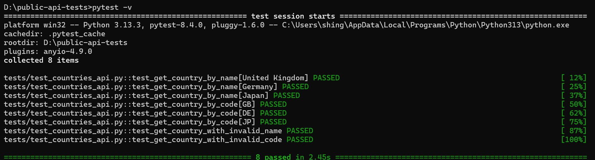

# Public API Automated Tests – REST Countries

## Overview
This project contains automated API tests built using Python, Pytest, and Requests.
The tests validate core functionality of the public REST Countries API.

API under test:
https://restcountries.com/

---

## Tech Stack
- Python
- Pytest
- Requests

---

## Test Cases

| Test Case ID | Endpoint | Description | Validations |
|-------------|---------|-------------|-------------|
| TC_API_01 | GET /name/{name} | Retrieve country by valid name | Status code 200, correct country name returned |
| TC_API_02 | GET /alpha/{code} | Retrieve country by valid ISO code | Status code 200, correct country code returned |
| TC_API_03 | GET /name/{name} | Retrieve country with invalid name | Status code 404 or 400 |
| TC_API_04 | GET /alpha/{code} | Retrieve country with invalid code | Status code 404 or 400 |

---

## Validation Approach

- **HTTP Status Code Validation**  
  Ensures the API responds correctly for both valid and invalid requests.

- **Response Structure Validation**  
  Confirms the API returns data in the expected format (list or object).

- **Business Logic Validation**  
  Verifies that the returned country data matches the requested input (name or ISO code).

- **Negative Scenario Validation**  
  Confirms invalid requests are handled gracefully and do not return misleading data.


## Test Execution

Below is a screenshot showing the API tests running locally on Windows:



---

## How to Run the Tests

```bash
pip install -r requirements.txt
pytest -v


